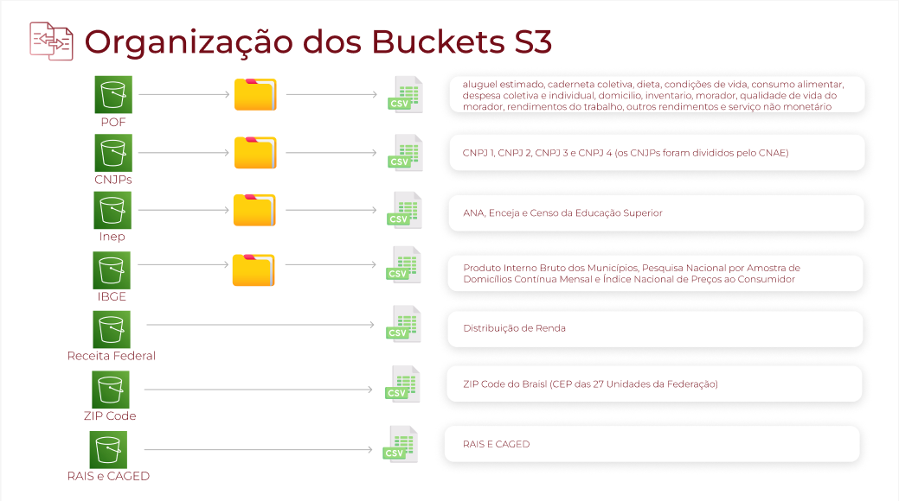
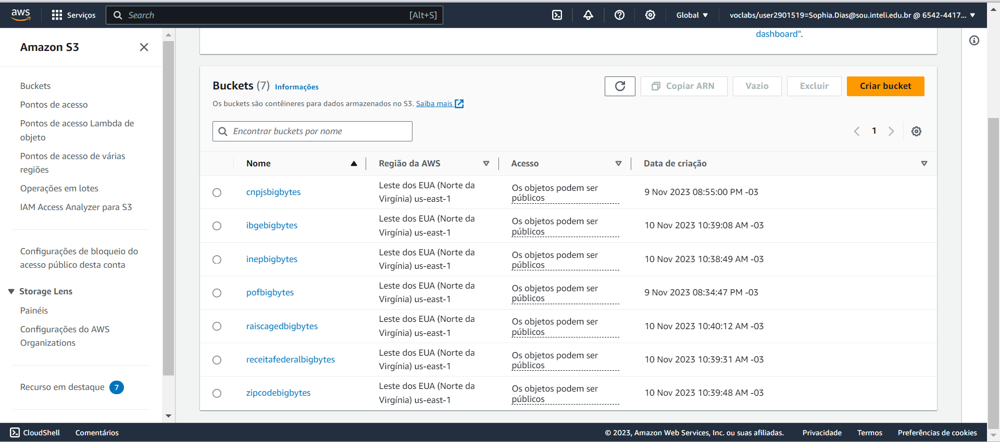
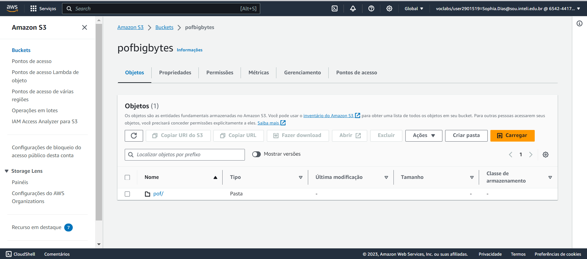
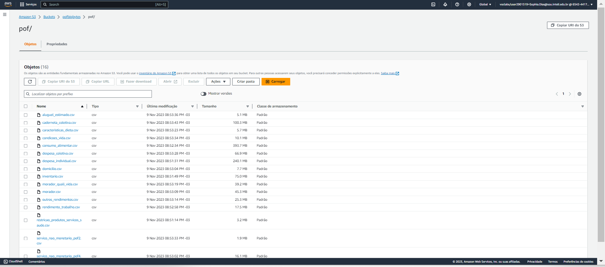

# Sprint 2

## 1. Análise descritiva dos dados

### 1.1 POF

**aluguel_estimado:** dados relacionados a domicílios e renda incluindo valores, formas de aquisição, meses de realização e informações sobre o rendimento bruto total mensal da unidade de consumo de várias unidades federativas do Brasil. Cada linha representa um domicílio e fornece detalhes sobre sua situação econômica. Os dados desta tabela proporcionam uma visão do potencial de consumo em diferentes canais e regiões, podendo contribuir para otimizar as estratégias do cliente no mercado alimentar e food service.

**caderneta_coletiva:** dados da pesquisa POF 2017-2018 no Brasil com informações sobre aquisições e despesas de domicílios de diferentes unidades da federação. Ela é útil para análises que incluem os padrões de gastos e o orçamento familiar de diferentes regiões do Brasil. coletivas ou compartilhadas pelas famílias, como despesas ou investimentos em comum.

**caracteristicas_dieta:** informações coletadas durante a POF de 2017-2018 no Brasil, onde cada linha corresponde a um domicílio. Cada domicio possui diversos detalhes incluídos como: hábitos alimentares, estrato de pesquisa, situação do domicílio, localização geográfica e informações de renda e saúde. Essa tabela permite uma compreensão dos comportamentos e das condições de vida dos domicílios de diferentes regiões do Brasil por fornecer uma visão das características das famílias brasileiras.

**condicoes_vida:** dados de quatro domicílios na pesquisa POF 2017-2018. Ela possui informações como rendimentos familiares e padrão de vida de várias áreas, o que pode ser útil para entender o panorama socioeconômico da região. Além disso, os fatores de expansão são fornecidos para permitir análises e estimativas populacionais.

**consumo_alimentar:** informações sobre o consumo de alimentos, especificando os tipos de alimentos, quantidades consumidas, valores nutricionais e renda total da unidade de consumo. Essa tabela é fundamental para compreender as condições financeiras das famílias e ter insights relacionados ao padrão de consumo de determinada região.

**despesa_coletiva:** dados sobre despesas coletivas da POF que descrevem serviços ou aquisição de produtos, como o tipo de produto, quantidade e a forma de aquisição. Esses registros são essenciais para compreender tendências de consumo a partir de uma análise do comportamento de consumo dos domicílios.

**despesa_individual:** informações sobre despesas individuais, ou seja, gastos específicos de cada membro da família. Esses dados incluem detalhes como tipo de despesa, valor gasto, localidade do domicílio, entre outros. Essa tabela pode ser útil na tomada de decisões em área como marketing por permitir uma análise dos comportamentos de consumo e como as despesas se distribuem.

**domicilio**: informações sobre as características dos domicílios, como tamanho, localização e condições de moradia (materiais de construção, abastecimento de água, uso de energia e número de cômodos). Essa tabela é fundamental pois permite análises que impulsionam ações em áreas da saúde e de infraestrutura.

**inventario:** registros de inventário de bens duráveis de domicílios,  incluindo informações como unidade federativa, tipo de situação e número do domicílio, tipo e quantidade de bem durável adquirido, entre outros. Esses dados permitem análises sobre padrões de consumo e correlações com a renda familiar e outras variáveis.

**morador_quali_vida:** informações sobre as características dos domicílios, incluindo dados sobre educação, sexo, composição familiar e renda disponível per capita. Essa tabela é útil para compreender padrões de consumo e suas tendências.

**morador:** informações relacionadas a renda e educação sobre os membros da família, incluindo o nível de instrução do morador e sua renda disponível. Esses dados são valiosos pois permitem uma análise sobre a relação o acesso à educação e distribuição de renda.

**outros_rendimentos:** informações sobre rendimentos recebidos por domicílios, incluindo unidade da federação, número do domicílio, código do informante, entre outros. Essa tabela pode ser útil para compreender as nuances da distribuição de renda em diferentes contextos sociais.

**rendimento_trabalho:** dados relacionados aos rendimentos obtidos por meio do trabalho, como salários e remunerações. Eles são essenciais para entender as condições financeiras de vida das famílias.

**restricao_produtos_servicos_saude:** informações sobre a restrição ou acesso a produtos e serviços de saúde pelas famílias. Eles incluem a situação do domicílio, estrato de amostragem, dados de renda mensal, entre outros. Essa tabela é essencial para compreender o comportamento financeiro relacionado a saúde.

**servico_nao_monetario_pof2:** informações sobre tipos e formas de despesas/aquisições não monetárias em domicílios. Essa tabela permite uma análise dos padrões de consumo e ajuda a entender o comportamento do consumidor.

**servico_nao_monetario_pof4: informações:** informações de despesas e aquisições não monetárias em domicílios, incluindo localização do domicílio, valores e detalhes sobre a despesa, entre outros. Esses dados são valiosos para entender como modelar o orçamento familiar em diferentes contextos sociais no Brasil.

## 2. Ingestão dos dados

A Ingestão de dados refere-se à primeira parte da arquitetura, Fonte de Dados, que ocorre de duas maneiras:

1. Carregamento dos dados governamentais em CSV para o ambiente cloud e
2. Carregamento de dados do cliente em tempo real da API para o ambiente cloud.

Optamos pelo uso do Amazon S3 para armazenamento na nuvem, criando um data lake inicial. O S3 oferece um serviço escalável e seguro, ideal para as necessidades do projeto.

A seguir será descrito o primeiro tipo de ingestão:

Os scripts Python permitem o upload de arquivos CSV para um bucket da Amazon S3. Cada fonte de dados tem seu respectivo bucket, sendo assim, 7 distintos buckets. A imagem abaixo descreve a sua organização dentro do ambiente AWS.



    Imagem 1 - Mapa Mental dos Buckets (Fonte: Confecção própria)

É possível perceber que alguns buckets contém uma pasta, enquanto outros somente arquivos. Isso acontece, pois algumas fontes de dados, como POF, possuem mais de 1 arquivo que a compõe, enquanto outras fontes possuem apenas 1, portanto, para manter a organização, foi criada uma pasta para estes que possuem mais de um arquivo. Abaixo encontram-se imagens dos buckets na AWS:



    Imagem 2 - Buckets do S3 BigBytes (Fonte: Painel AWS Sophia)



    Imagem 3 - Bucket POF BigBytes (Fontes: Painel AWS Sophia)



    Imagem 4 - Pasta POF Arquivos CSVs (Fonte: Painel AWS Sophia)

### Script Python

Os scripts Python para o carregamento dos dados funciona da seguinte maneira:

1. `__init__`: Estabelece conexão com o bucket S3 (para isso, são necessárias as credenciais AWS CLI e informações do bucket, como seu nome e pasta de upload);
2. `read_and_prepare_data`: Lê todos os arquivos CSVs de uma pasta e Substitui os valores ausentes por 0, visto que a descrição dos dados diz que 'Branco = não aplicável' nas variáveis com NaN e
3. `upload_folder_to_s3`: Faz o upload de cada arquivo por vez no bucket S3.

## Pré-requisitos

- Python 3
- Bibliotecas: `boto3`, `pandas`
- Credenciais AWS válidas (Access Key ID, Secret Access Key, Session Token)
- Nome do bucket S3 da AWS

## Configuração

1. Instale as bibliotecas necessárias:

```python
     pip install boto3 pandas
```

2. Certifique-se de ter as credenciais AWS (Access Key, Secret Access Key, Session Token).

## Uso

1. **Configuração Inicial**: Substitua as credenciais e informações do bucket na seção `if __name__ == "__main__":` do script.

   ```python
   aws_access_key_id = 'YOUR_AWS_ACCESS_KEY_ID'
   aws_secret_access_key = 'YOUR_AWS_SECRET_ACCESS_KEY'
   aws_session_token = 'YOUR_AWS_SESSION_TOKEN'
   bucket_name = 'YOUR_BUCKET_NAME'
   folder_path = 'YOUR_FOLDER_PATH'  
   s3_folder = 'YOUR_S3_FOLDER_NAME'  
   ```

2. **Execução do Script**: Execute o script para iniciar o processo de upload. Os arquivos CSV no diretório especificado serão carregados para o bucket S3 designado.

   ```python
   nome_do_seu_script.py
   ```

## Notas Adicionais

- O script está configurado para trabalhar com arquivos CSV. Modificações podem ser necessárias para outros formatos de arquivo.
- As credenciais AWS e o nome do bucket são sensíveis e não devem ser compartilhados publicamente.
- Os scripts também possuem funções que realizam o mesmo processo para o serviço Azure Blob, visto que o cliente informou o serviço cloud utilizado internamente, portanto só é necessário descomentar as funções, variáveis e bibliotecas que realizam esse processo.

# 2.1 Ingestão de dados e armazenamento na AWS RDS

A criação de uma instância EC2 (Elastic Compute Cloud) e de um banco de dados RDS (Relational Database Service) é substancial para suportar a requisição e armazenamento de dados da API do parceiro. 

### Criação de uma Instância EC2:


### Criação de um Banco de Dados RDS:


### Configuração e conexão no Código Python:

[Conexão RDS e API](https://github.com/2023M8T4Inteli/grupo1/blob/main/src/AWS%20RDS/ConexaoRDS_API.py) realiza a obtenção dos dados da API do parceiro e realiza a inserção em um banco de dados PostgreSQL. 

### **Função `insert_data_into_rds(data)`:**

Esta função recebe um conjunto de dados **`data`** e os insere em uma tabela PostgreSQL especificada.

1. Estabelece uma conexão com o banco de dados usando os parâmetros fornecidos.
2. Obtém o nome da tabela e as colunas a partir dos dados.
3. Constrói uma consulta de inserção SQL parametrizada usando a biblioteca **`psycopg2.sql`**.
4. Executa a consulta e confirma a transação.
5. Fecha o cursor e a conexão.

### **Configuração da Requisição à API:**

- **`url`**: A URL da API.
- **`params`**: Parâmetros da requisição HTTP, incluindo um código e a tabela desejada ("sale").

## Referências

- [Documentação AWS S3](https://docs.aws.amazon.com/s3/index.html)
- [Documentação boto3](https://boto3.amazonaws.com/v1/documentation/api/latest/index.html)
