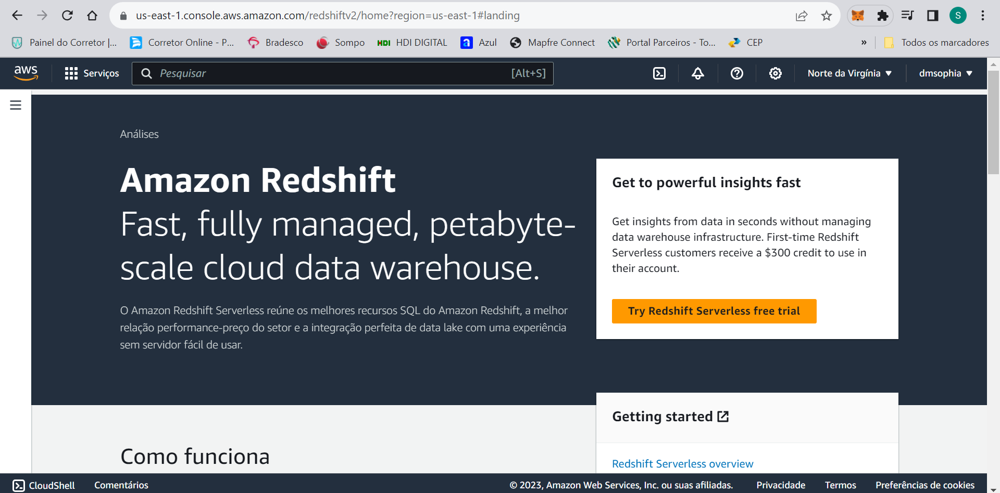
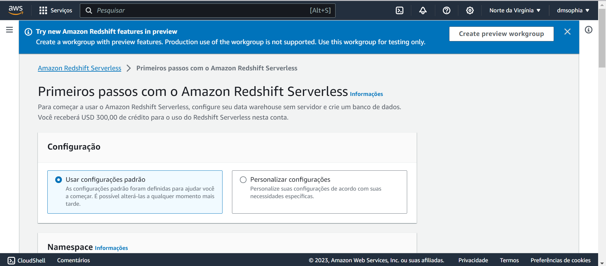
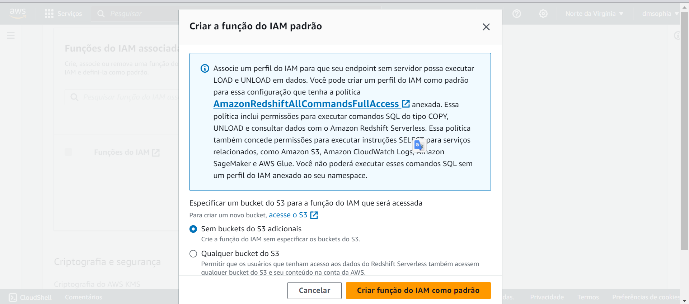
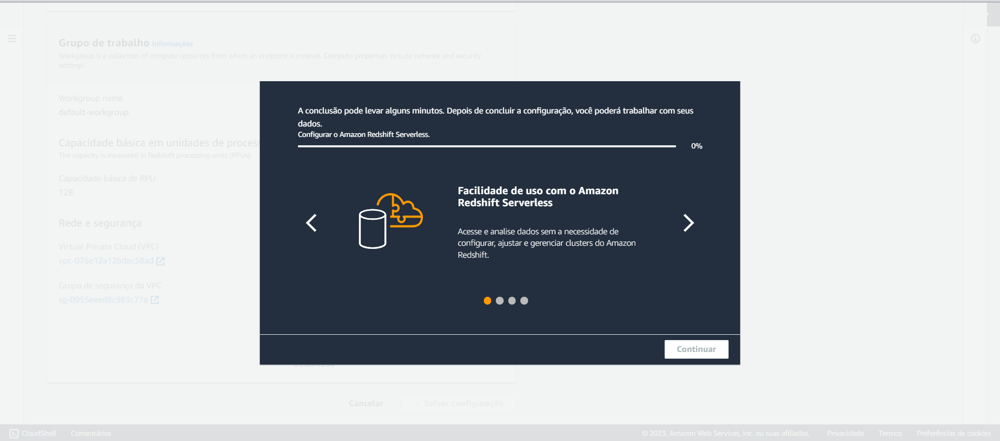
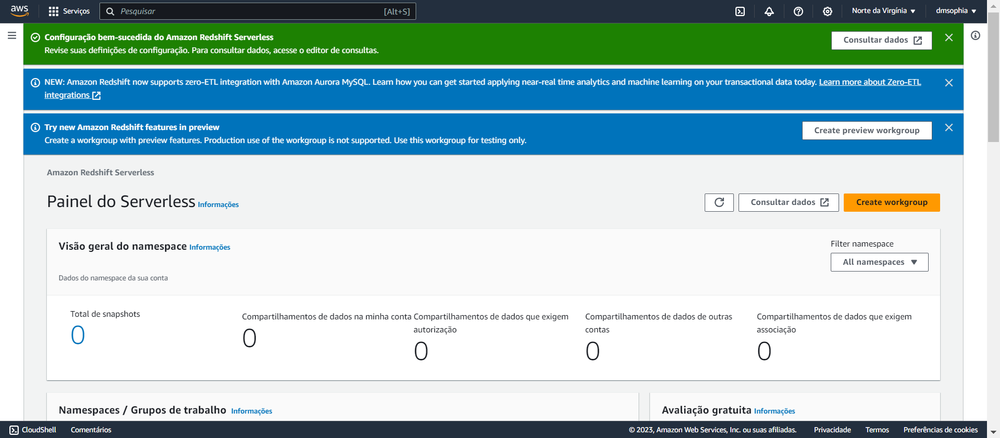
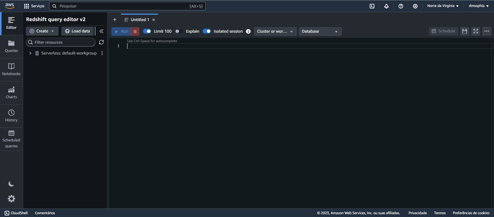
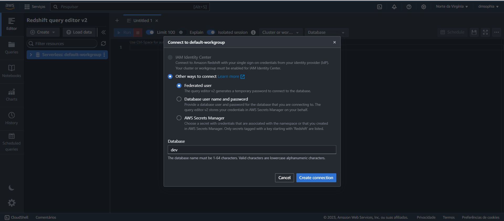
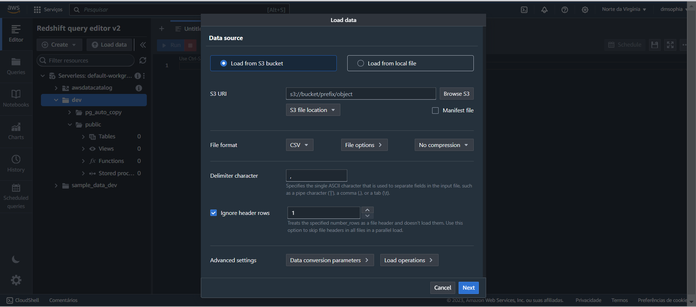
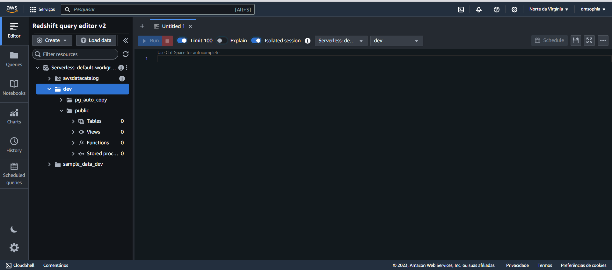
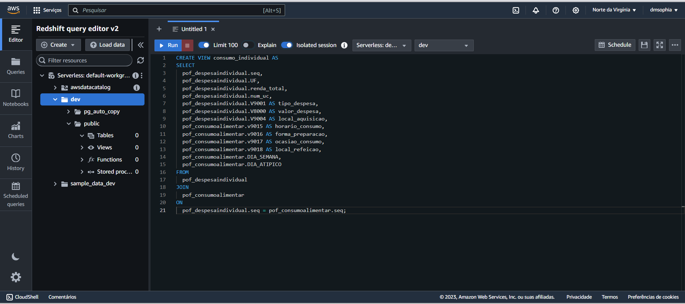

# Desenvolvimento do cubo de dados

## 1.  Documentação do Processo de ETL para Cubo de Dados OLAP

Este documento descreve o processo de extração, transformação e carga (ETL) utilizado para consolidar dados de diversas fontes e alimentar um cubo de dados OLAP, utilizando as ferramentas da AWS para análise e visualização.

### 1.1 Visão geral

O objetivo deste pipeline de ETL é extrair dados de diversas fontes, transformá-los em um formato estruturado adequado para processamento analítico e carregá-los em uma solução de armazenamento de dados. O objetivo final é facilitar a análise de dados complexos e multidimensionais para tarefas rápidas e interativas de inteligência de negócios.

### 1.2 Processo do ETL

#### 1.2.1. Extração de dados

O processo começa com a coleta de dados brutos de diversas fontes, incluindo APIs, bancos de dados e arquivos de texto. Esses dados são geralmente heterogêneos em formato e qualidade e podem conter redundâncias e inconsistências.

#### 1.2.2. Transformação de dados

Após a coleta, os dados passam por uma fase crítica de limpeza e transformação. A limpeza envolve a remoção de duplicatas e valores nulos, enquanto a transformação inclui a normalização e estruturação dos dados para facilitar análises futuras. Esta etapa é essencial para garantir a integridade e a qualidade dos dados.

#### 1.2.3. Carregamento no AWS S3

Os dados limpos e transformados são então carregados no serviço de armazenamento em nuvem AWS S3. O formato CSV é adotado por sua simplicidade e interoperabilidade. O S3 atua como um repositório temporário e não organizado, um data lake, que mantém os dados acessíveis e prontos para serem transferidos para o data warehouse. Para entender mais sobre esse tópico, visualize a documentação Sprint 2.

Um **DataLake** é um repositório centralizado que ingere e armazena grandes volumes de dados em sua forma original. Os dados podem ser processados e usados como base para uma variedade de necessidades analíticas. Devido à sua arquitetura aberta e escalonável, um DataLake pode acomodar todos os tipos de dados de qualquer fonte, desde dados estruturados (tabelas de banco de dados, planilhas do Excel) até semiestruturados (arquivos XML, páginas da Web) e não estruturados (imagens, arquivos de áudio, tweets). Abaixo é possível entender as características que fazem esse serviço ser propício ao Data Lake:

◦ **Escalabilidade**: AWS S3 lida com a escala, agilidade e flexibilidade necessárias para combinar diferentes abordagens de dados e análises. ` `
◦ **Armazenamento de todos os dados**: Como o Amazon S3 escala de forma econômica, praticamente sem limites, você pode armazenar todos os seus dados, de qualquer fonte, e desbloquear seu valor. ` `
◦ **Eliminação da gestão de servidores**: Com as opções mais sem servidor para análise de dados na nuvem, os serviços de análise da AWS são fáceis de usar, administrar e gerenciar. ` `

Para as etapas de transformação e carga dos dados, foi escolhido a utilização de script Python. Tal escolha é justificada pelos seguintes fatores:

1. **Facilidade de uso e manutenção;**
2. **Bibliotecas ligadas diretamente às ferramentas AWS e Azure;**
3. **Portabilidade e Interoperabilidade.**

Acesso aos scripts desenvolvidos:
[Pasta - Script](https://github.com/2023M8T4Inteli/grupo1/tree/main/src/Script)

### 1.3 Armazenamento e análise de dados

OLAP (Online Analytical Processing) é uma tecnologia de banco de dados que foi otimizada para consulta e relatórios, em vez de processar transações. Um cubo OLAP é uma estrutura de dados montada de forma multidimensional, e que proporciona uma rápida análise de valores quantitativos ou medidas relacionadas com determinado assunto, sob diversas perspectivas diferentes.  Os metadados do cubo são tipicamente criados a partir de um esquema de estrela ou esquema floco de neve de tabelas em um banco de dados relacional.

As fontes de dados utilizados a partir do Data Lake são:

- **IBGE Dados Abertos** (CSV)- “Dados Abertos | IBGE” é uma iniciativa do Instituto Brasileiro de Geografia e Estatística (IBGE) que visa promover a transparência e a acessibilidade dos dados coletados pelo instituto. O IBGE é uma das principais fontes de dados estatísticos sobre o Brasil, fornecendo informações valiosas em diversas áreas, como demografia, economia, geografia.
- **POF (pesquisa orçamento familiar - POF 2017-2018 | IBGE** (CSV) - A Pesquisa de Orçamentos Familiares (POF) é um levantamento realizado pelo Instituto Brasileiro de Geografia e Estatística (IBGE) no Brasil. A POF tem como objetivo coletar informações detalhadas sobre os gastos e o padrão de vida das famílias brasileiras. O levantamento é conduzido a cada 5 anos, o que permite ao IBGE monitorar e analisar as mudanças nos hábitos de consumo e nas condições de vida da população.
- **Receita Federal Dados Abertos** (CSV) - Os “Dados Abertos” disponibilizados pela Receita Federal se referem a informações e conjuntos de dados que a Receita Federal do Brasil torna disponíveis ao público em geral para consulta e uso. Esses dados abertos geralmente incluem informações relacionadas a tributação, arrecadação, cadastros de contribuintes, normas fiscais e outros aspectos relacionados à administração fiscal e aduaneira no Brasil.
- **Dados Abertos MEC** (CSV)- Dados Abertos MEC é um sistema de informação mantido pelo Ministério da Educação que oferece diversos dados sobre a educação no Brasil.
- **Microdados Instituto Nacional de Estudos e Pesquisas Educacionais Anísio Teixeira** (CSV)- Dados Abertos INEP é um sistema do Instituto Nacional de Estudos e Pesquisas Educacionais Anísio Teixeira que reúne microdados educacionais detalhados.
- **OPENDATASUS** (CSV)- Open Data SUS é uma plataforma mantida pelo Ministério da Saúde que disponibiliza dados abertos relacionados à saúde no Brasil.
- **Zip and Postal Codes of All Countries | Database Hub**  (CSV)- From-to Zip Code to Lat-Long é uma base de dados que oferece informações sobre códigos postais de todos os países e suas respectivas coordenadas geográficas.
- **CNPJs** (CSV)- Storage Account com as bases de CNPJ é um conjunto de dados que provêm de registros oficiais sobre empresas no Brasil, categorizados pelo Código Nacional de Atividade Econômica (CNAE). As bases foram divididas em quatro partes, cada uma representando um subconjunto distinto de CNAEs.
- **API** (JSON) **-** BASE DE VENDAS FICTÍCIA VIA ENDPOINT INTEGRATION é uma base de dados simulada que representa as transações de vendas de um distribuidor fictício. Esta base é disponibilizada através de um endpoint específico e é formatada em JSON, uma linguagem leve de intercâmbio de dados de fácil leitura para humanos e máquinas. O conteúdo deste dataset é atualizado diariamente, incorporando novas vendas que são associadas a alguns dos CNPJs listados anteriormente, e se concentra nas categorias de produtos de interesse.

Para armazenar e utilizar esses dados visando Business Inteligence, foi escolhido um **Data Warehouse**, que armazena dados que foram tratados e transformados com uma finalidade específica em mente, que podem ser usados para gerar insights. Em um banco de dados relacional, o esquema define as tabelas, campos, relacionamentos, visões, índices, pacotes, procedimentos, funções, filas, gatilhos, tipos, sequências, visões materializadas, sinônimos, enlaces de banco de dados, diretórios, entre outros elementos. Abaixo estão descritas as caracterísitcas que fazem o AWS Redshift ser a escolha ideal para essa função:
◦ **Alto desempenho**: O Redshift alcança alto desempenho usando paralelismo massivo, compressão de dados eficiente, otimização de consultas e distribuição. ` `
◦ **Velocidade**: Quando se trata de carregar dados e consultá-los para análises e relatórios, o Redshift é extremamente rápido. ` `
◦ **Segurança**: O Redshift tem recursos de segurança integrados, incluindo isolamento de rede, criptografia de descanso e autenticação IAM. ` `
◦ **Suporte para novas funcionalidades SQL**: O Amazon Redshift suporta funcionalidades SQL, para simplificar a construção multidimensional do cubo e incorporar dados em rápida mudança. ` `

### 1.3.1. Configuração do AWS Redshift

1. No Console da AWS, buscar por AWS Redshift

   
2. Clique em 'Try Redshift Serveless'para abrir as configurações de criação do Redshift

   
3. Rolando a tela em 'Funções do IAM associadas', clique em 'Gerenciar funções do IAM' e logo em seguida em 'Criar função'

   
4. Selecione 'Sem buckets do S3 adicionais' e crie a função

   
5. Role a tela até o fim e crie o Redshift Serveless. Aguarde.

   
6. Após a conclusão, clique em continue. O Painel do Serveless será aberto, então selecione 'Consultar dados'

   
7. Em 'Consultar dados' essa será a página default

   
8. Clique em 'Load data' para carregar os arquivos desejados do Data Lake. Lembre-se que o Data Lake são os buckets do S3. Crie a conexão com o 'Federated User'.

   
9. Carregue seus dados colocando a URI do seu bucket do S3 e a região dele.

   
10. Agora faça a navegação: Serveless -> dev -> public. Em 'tables', será possível ver todas as suas tabelas carregadas dos buckets do S3 (realizado no passo anterior).

    
11. Ao lado direito, no editor, coloque suas manipulações SQL desejadas para tirar os insights das suas tabelas. As chamadas VIEWS, você poderán juntar dados das tabelas, criando outras, para então extrair insights.

    

### 1.3.2 Estrutura do Data Warehouse: Arquitetura de Três Fases

O Data Warehouse na arquitetura de dados adota uma estrutura trifásica, compreendendo as fases de Worker, Raw e Trusted, para assegurar a eficácia do processamento e armazenamento de dados.

1. **Fase Worker**: É o ponto de partida do pipeline de dados, onde ocorre a coleta inicial de dados brutos de fontes variadas. Aqui, os dados são capturados em seu estado mais puro, sem qualquer tratamento prévio.
2. **Fase Raw**: Nesta etapa, os dados coletados são armazenados no Data Lake em seu formato original. Esta fase serve como um repositório temporário e flexível, permitindo o armazenamento de grandes volumes de dados em diversas estruturas.
3. **Fase Trusted**: Representa a etapa final do pipeline. Aqui, os dados brutos passam por um processo de transformação e limpeza, sendo posteriormente carregados no Data Warehouse. Nesta fase, os dados estão prontos para serem utilizados em análises e relatórios, estando estruturados e confiáveis.

#### 1.3.1.1 Utilização de Views no Data Warehouse

As views no Data Warehouse desempenham um papel crucial, agindo como representações virtuais de tabelas derivadas de uma ou mais fontes de dados. Estas views não armazenam dados fisicamente, mas facilitam a consulta e manipulação dos dados de forma simplificada e eficiente.

- **View "consumo_domicilio"**: Esta view é criada pela junção das tabelas "pof_domicilio" e "pof_morador", utilizando a coluna "num_dom" como chave de junção. Ela consolida informações relevantes dos domicílios e dos moradores, como tipo de domicílio, presença de água canalizada, rendimento dos moradores, e outros dados socioeconômicos.
- **View "consumo_individual"**: Formada pela junção das tabelas "pof_despesaindividual" e "pof_consumoalimentar", esta view oferece uma visão detalhada sobre os padrões de consumo e despesas individuais. Através dela, é possível analisar informações como o valor da despesa, tipo de produto consumido, local e horário de consumo, proporcionando insights valiosos sobre os hábitos de consumo.

Estas views são essenciais para proporcionar uma análise mais profunda e segmentada dos dados, permitindo que usuários e analistas acessem informações específicas de forma rápida e eficiente, sem a necessidade de consultar as tabelas de dados originais em sua totalidade. Os códigos para as views estão disponíveis em

### 1.4. Aspectos de segurança, privacidade e conformidade

A segurança de dados está mais focada em proteger a informação de ataques cibernéticos e violações. Já a privacidade trabalha a parte de como essa informação é coletada, compartilhada e utilizada. A arquitetura de dados é fundamental para organizar, padronizar e gerenciar informações valiosas para uma empresa. Afinal, ela é responsável por garantir a qualidade, segurança e integridade dos dados. Bem como disponibilizá-los de forma clara e eficiente a fim de apoiar a tomada de decisões estratégicas.

A privacidade de dados e o impacto na arquitetura são importantes para a conformidade com a LGPD (Lei Geral de Proteção de Dados), que pode exigir adequações nas estruturas físicas e arquitetônicas das empresas, especialmente diante da possibilidade de acessos indevidos por parte de terceiros. A LGPD possui amplo alcance, fazendo com que as empresas, independentemente do ramo de atuação, comecem a estruturar uma linha de planejamento sobre a forma de proteção ao tratamento dos dados pessoais de seus clientes e colaboradores, a fim de evitar infrações, que certamente irão culminar em prejuízos financeiros e danos na reputação.

Na fase de coleta, os dados são adquiridos de várias fontes. A segurança envolve a autenticação para garantir que apenas fontes confiáveis possam fornecer dados. Além disso, os dados são criptografados durante a transmissão para proteger contra interceptação.

Durante a ingestão, os dados são trazidos para o sistema. Novamente, a autenticação e a criptografia são usadas para garantir que apenas dados autorizados sejam ingeridos. Além disso, os dados podem ser validados neste ponto para garantir que eles atendam a certos padrões de qualidade e consistência.

Na fase de processamento, os dados são transformados e enriquecidos. A segurança envolvo o controle de acesso para garantir que apenas usuários autorizados possam realizar operações de processamento.

Durante o armazenamento, os dados são mantidos para uso futuro. A segurança é relacionada à criptografia de dados em repouso para proteger contra acesso não autorizado. Além disso, os backups regulares são realizados para proteger contra perda de dados.

### 1.5. **Monitoramento e gerenciamento do processo de ETL**

O Amazon CloudWatch é um serviço de monitoramento e gerenciamento que tem como função fornecer dados práticos para recursos de aplicativos e infraestruturas locais, híbridos e da AWS. Com ele é possível coletar métricas e operações na forma de logs, propiciar visualização unificada dos recursos e resolver problemas. O Amazon CloudWatch coleta e visualiza logs, métricas e dados de eventos em tempo real em painéis automatizados para otimizar sua infraestrutura e manutenção da aplicação. Garante-se, então, o monitoramento, para pleno funcionamento dos scripts Python e a arquitetura na cloud.
